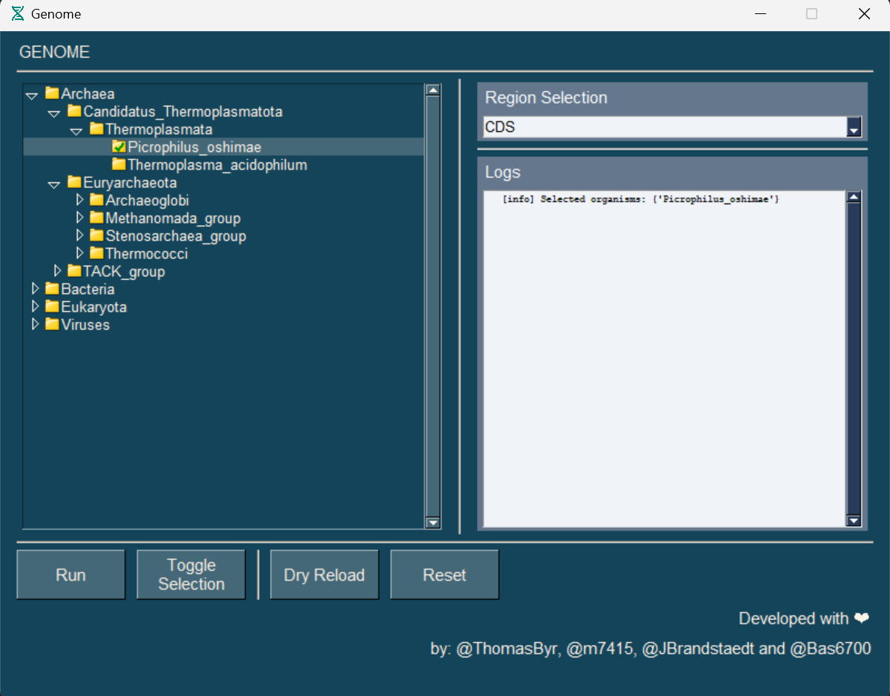

#  BioInfo - Genome

[](https://docs.microsoft.com/en-us/windows/wsl/tutorials/gui-apps)
[](https://svgshare.com/i/ZhY.svg)
[](https://github.com/ThomasByr/BioInfo-genome/blob/master/LICENSE)
[](https://GitHub.com/ThomasByr/BioInfo-genome/commit/)
[](https://gitHub.com/ThomasByr/BioInfo-genome/commit/)
[](https://GitHub.com/ThomasByr/BioInfo-genome/graphs/commit-activity)

[](https://github.com/ThomasByr/BioInfo-genome)
[](https://github.com/ThomasByr)
[](https://github.com/m7415)
[](https://github.com/JBrandstaedt)
[](https://github.com/Bas6700)

1. [✏️ Setup](#️-setup)
2. [👩‍🏫 Usage](#-usage)
3. [🧪 Testing](#-testing)
4. [🧑‍🏫 Contributing](#-contributing)
5. [⚖️ License](#️-license)
6. [🐛 Bugs and TODO](#-bugs-and-todo)

## ✏️ Setup

> **Note**
> This project is part of a M1 project at the University of Strasbourg, France.

First, make sure you have `python >= 3.10` installed with the required dependencies :

```ps1
pip install --upgrade -r requirements.txt
```

Then, you can run the program with :

```ps1
python .\genome.py
```

<details><summary>and for Linux ...</summary>

```bash
python3 genome.py
```

</details>

<br>

On a side note, we use [PySimpleGUI](https://pysimplegui.readthedocs.io/en/latest/) to build the GUI, so you might want to check out their [documentation](https://pysimplegui.readthedocs.io/en/latest/) if you want to contribute to the project ! 🙂 We also use [BioPython](https://biopython.org/) to parse the genome files with ease. We strongly advise to check for solid internet connection when running the program for the first time, as it will download the genome files from [NCBI](https://ftp.ncbi.nlm.nih.gov/genomes/GENOME_REPORTS/) and build the system tree from scratch.

## 👩‍🏫 Usage

The program is pretty simple to use, just follow the instructions and you'll be fine ! 🙂

A window should pop up, and the first run might take a while, but after that, it should be pretty fast !

To enable `debug` mode, just add `DEBUG=True` to the environment variables. This could be done by adding `Debug=True` to an `.env` file in the root directory, or by running the following command in a terminal :

```ps1
$env:DEBUG = "True"
```

<details><summary>and for Linux ...</summary>

```bash
export DEBUG=True
```

</details>

<br>

If you ever want to force base rebuild of the system tree, you can either pass `True` as the first argument from `overview.build()` in [genome.py](genome.py), or add `REBUILD=True` to the environment variables.

```ps1
$env:REBUILD = "True"
```

<details><summary>and for Linux again ...</summary>

```bash
export REBUILD=True
```

</details>

<br>

Anyways, here's a screenshot of the GUI :



It is pretty self-explanatory, but here's a quick rundown :

- `Results` : On the left panel, you can see the system tree.

This tree is built from https requests to the NCBI FTP server, and is used to navigate through the genome files. Because there are a lot of files, this tree view is generated on the fly, when you double click on a node. Files and folders are displayed with their respective icons, and the tree is sorted alphabetically.

- `Region Selection` : On the right panel, you can see the region selection.

This is a dropdown menu that allows you to select a region of the genome.

- `Log` : On the bottom-right panel, you can see the log.

This is a redirection of the standard output, so you can see what's going on under the hood. All threads outputs are also redirected here ; but spammy outputs are being proxied.

- `Buttons` : On the bottom-left panel, you can see 4 buttons.

The first one is the `Run` button, which will run the program with the selected organism and region. The second one is the `Toggle Selection` button, which will toggle all preselection from the tree view (alternatively, you can select and right-click). Then the third one is `Dry Reload` which will reload the tree view without altering anything. The fourth one is `Reset`, which will reset the system tree and the tree view entirely.

## 🧪 Testing

Oh god... please don't.

Still, make sure you have `pytest` up and ready and then run :

```ps1
pytest src
```

You can also use the vscode UI to run the tests, just click on the `Run All Tests` button on the left of the `Test Explorer` tab.

## 🧑‍🏫 Contributing

If you ever want to contribute, either request the contributor status, or, more manually, fork the repo and make a pull request !

We are using [yapf](https://github.com/google/yapf) to format the code, so make sure you have it installed and run :

```ps1
yapf -ir src
```

> The standard procedure is :
>
> ```txt
> fork -> git branch -> push -> pull request
> ```
>
> Note that we won't accept any PR :
>
> - that does not follow our Contributing Guidelines
> - that is not sufficiently commented or isn't well formated
> - without any proper test suite
> - with a failing or incomplete test suite

Happy coding ! 🙂

## ⚖️ License

This project is licensed under the AGPL-3.0 new or revised license. Please read the [LICENSE](LICENSE) file.

- Redistributions of source code must retain the above copyright notice, this list of conditions and the following disclaimer.

- Redistributions in binary form must reproduce the above copyright notice, this list of conditions and the following disclaimer in the documentation and/or other materials provided with the distribution.

- Neither the name of the BioInfo-genome authors nor the names of its contributors may be used to endorse or promote products derived from this software without specific prior written permission.

THIS SOFTWARE IS PROVIDED BY THE COPYRIGHT HOLDERS AND CONTRIBUTORS "AS IS" AND ANY EXPRESS OR IMPLIED WARRANTIES, INCLUDING, BUT NOT LIMITED TO, THE IMPLIED WARRANTIES OF MERCHANTABILITY AND FITNESS FOR A PARTICULAR PURPOSE ARE DISCLAIMED. IN NO EVENT SHALL THE COPYRIGHT HOLDER OR CONTRIBUTORS BE LIABLE FOR ANY DIRECT, INDIRECT, INCIDENTAL, SPECIAL, EXEMPLARY, OR CONSEQUENTIAL DAMAGES (INCLUDING, BUT NOT LIMITED TO, PROCUREMENT OF SUBSTITUTE GOODS OR SERVICES; LOSS OF USE, DATA, OR PROFITS; OR BUSINESS INTERRUPTION) HOWEVER CAUSED AND ON ANY THEORY OF LIABILITY, WHETHER IN CONTRACT, STRICT LIABILITY, OR TORT (INCLUDING NEGLIGENCE OR OTHERWISE) ARISING IN ANY WAY OUT OF THE USE OF THIS SOFTWARE, EVEN IF ADVISED OF THE POSSIBILITY OF SUCH DAMAGE.

## 🐛 Bugs and TODO

**TODO** (first implementation version)

- [x] add region selection feature
- [x] add multi organisms selection feature and thread it
- [x] open txt file on double click
- [x] add checkboxes to select organisms

**Known Bugs** (latest fix)

- selection can be made with anything in the tree (including not leafs folders and even files)
- ~~dynamic selection does not display newly created files~~
- ~~double click not working~~ (removed `if __name__ == "__main__":` from `genome.py`)
- ~~bad paths~~ (hopefully fixed by removing `.pkl` files from sync to force rebuild on unknown OS)
- folder expansion resets all checked icons to unchecked
