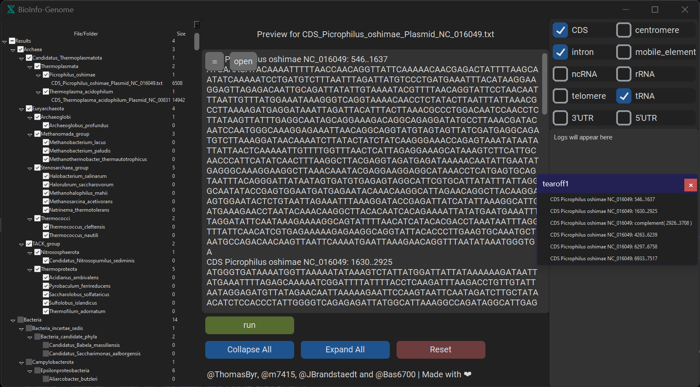

#  BioInfo - Genome

[](https://github.com/ThomasByr/BioInfo-genome/actions/workflows/python-package.yml)
[](https://github.com/ThomasByr/BioInfo-genome/blob/master/LICENSE)
[](https://GitHub.com/ThomasByr/BioInfo-genome/commit/)
[](https://gitHub.com/ThomasByr/BioInfo-genome/commit/)
[](https://GitHub.com/ThomasByr/BioInfo-genome/graphs/commit-activity)

[](https://github.com/ThomasByr/BioInfo-genome)
[](https://github.com/ThomasByr)
[](https://github.com/m7415)
[](https://github.com/JBrandstaedt)
[](https://github.com/Bas6700)

1. [✏️ Setup](#️-setup)
2. [👩‍🏫 Usage](#-usage)
3. [🧑‍🏫 Contributing](#-contributing)
4. [⚖️ License](#️-license)
5. [🐛 Bugs and TODO](#-bugs-and-todo)
6. [🎨 Logo and Icons](#-logo-and-icons)

## ✏️ Setup

> <picture>
>   <source media="(prefers-color-scheme: light)" srcset="https://raw.githubusercontent.com/Mqxx/GitHub-Markdown/main/blockquotes/badge/light-theme/note.svg">
>   
> </picture><br>
>
> This project is part of a M1/M2 project at the University of Strasbourg, France.

First, make sure you have `python >= 3.10.6` installed with the required dependencies:

```bash
# conda create -n <name> python=3.11 pip -y && conda activate <name>
pip install --upgrade -r requirements.txt
```

Then, you can run the program with :

```bash
python genome.py
```

On a side note, we use [CustomTkinter](https://github.com/TomSchimansky/CustomTkinter) to build the GUI, so you might want to check out their documentation if you want to contribute to the project ! 🙂 We also use [BioPython](https://biopython.org/) to parse the genome files with ease. We strongly advise to check for solid internet connection when running the program for the first time, as it will download the genome files from [NCBI](https://ftp.ncbi.nlm.nih.gov/genomes/GENOME_REPORTS/) and build the system tree from scratch.

## 👩‍🏫 Usage

The program is pretty simple to use, just follow the instructions and you'll be fine ! 🙂

A window should pop up, and the first run might take a while, but after that, it should be pretty fast !

Anyways, here's a screenshot of the GUI :



## 🧑‍🏫 Contributing

If you ever want to contribute, either request the contributor status, or, more manually, fork the repo and make a pull request !

We are using [black](https://github.com/psf/black) to format the code, so make sure you have it installed and run :

```bash
black src
```

> The standard procedure is :
>
> ```txt
> fork -> git branch -> push -> pull request
> ```
>
> Note that we won't accept any PR :
>
> - that does not follow our Contributing Guidelines
> - that is not sufficiently commented or isn't well formated
> - without any proper test suite
> - with a failing or incomplete test suite

Happy coding ! 🙂

## ⚖️ License

> <picture>
>   <source media="(prefers-color-scheme: light)" srcset="https://raw.githubusercontent.com/Mqxx/GitHub-Markdown/main/blockquotes/badge/light-theme/warning.svg">
>   
> </picture><br>
>
> This repository is an app and might be exported as a standalone binary. Working source code is licensed under AGPL, the text assets are unlicensed, images and logos have their own section. The following license only applies to the template itself and is not legal advice. <FONT COLOR="#ff0000"><u>The license of this repo does not apply to the resources used in it.</u></FONT> Please check the license of each resource before using them.

This project is licensed under the AGPL-3.0 new or revised license. Please read the [LICENSE](LICENSE.md) file. Additionally :

- Redistributions of source code must retain the above copyright notice, this list of conditions and the following disclaimer.

- Redistributions in binary form must reproduce the above copyright notice, this list of conditions and the following disclaimer in the documentation and/or other materials provided with the distribution.

- Neither the name of the BioInfo-genome authors nor the names of its contributors may be used to endorse or promote products derived from this software without specific prior written permission.

```LICENSE
BioInfo-genome - large-scale genome analysis tool
Copyright (C) 2023 ThomasByr & contributors

This program is free software: you can redistribute it and/or modify
it under the terms of the GNU Affero General Public License as published by
the Free Software Foundation, either version 3 of the License, or
(at your option) any later version.

This program is distributed in the hope that it will be useful,
but WITHOUT ANY WARRANTY; without even the implied warranty of
MERCHANTABILITY or FITNESS FOR A PARTICULAR PURPOSE. See the
GNU Affero General Public License for more details.

You should have received a copy of the GNU Affero General Public License
along with this program. If not, see <http://www.gnu.org/licenses/>.
```

## 🐛 Bugs and TODO

**TODO** (first implementation version)

- [x] add region selection feature
- [x] add multi organisms selection feature and thread it
- [x] open txt file on double click
- [x] add checkboxes to select organisms
- [x] separate reload and update (for ids) (are no longer saved)
- [x] maybe save `overview.txt` ? (no longer needed)
- [ ] take into account all `.txt` files when building the tree

**Known Bugs** (latest fix)

- ~~selection can be made with anything in the tree (including not leafs folders and even files)~~
- ~~dynamic selection does not display newly created files~~
- ~~double click not working~~ (removed `if __name__ == "__main__":` from `genome.py`)
- ~~bad paths~~ (hopefully fixed by removing `.pkl` files from sync to force rebuild on unknown OS)
- ~~folder expansion resets all checked icons to unchecked~~ (fixed by re-changing all selected items icons to checked)
- manually inserting files in "Results" may cause errors (especially if the file is not a `.txt` file)

## 🎨 Logo and Icons

Unless otherwise stated, all icons and logos are made by the author.
Copyright (C) 2023 Thomas BOUYER, all rights reserved.

Tools used :

- [Microsoft Designer](https://designer.microsoft.com/)
- [Clip Studio Paint](https://www.clipstudio.net/en)
- [Canva](https://www.canva.com/)
